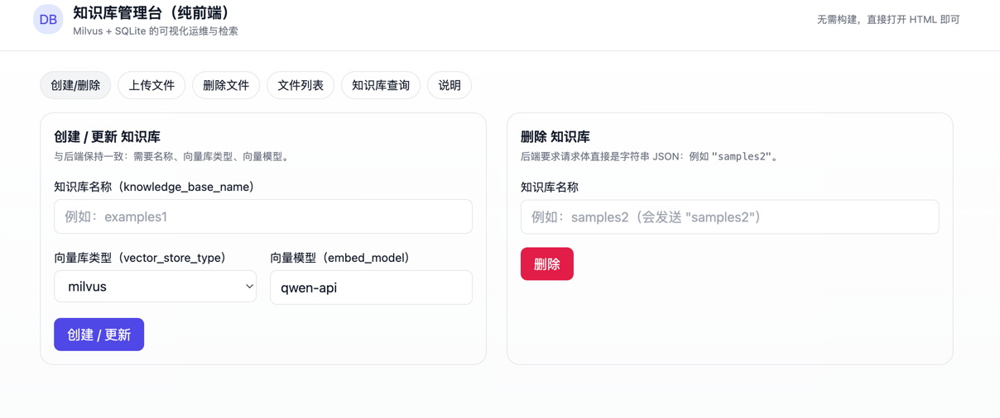

# 页面介绍




# 一、📘 **项目简介**

本项目是一个基于 **大语言模型（LLM）** 与 **检索增强生成（RAG）** 的本地化知识库问答系统，旨在为用户提供一个安全、可控、可定制的智能问答解决方案。

系统支持用户上传各类文档（如 PDF、Word、TXT 等），自动将其切片并转化为向量，存储于 **向量数据库Milvus（如 FAISS、PGVector后续可以添加更新）** 中。当用户提问时，系统通过语义检索从知识库中召回最相关的内容，结合大语言模型进行上下文理解与自然语言生成，返回精准、可解释的答案。

项目基于 **FastAPI** 构建 RESTful 接口，采用 **SQLite** 存储对话历史与元数据，集成 **LangChain** 框架实现多轮对话记忆、流式输出（SSE）、回调追踪等功能，支持多模型接入（如 Qwen、ChatGLM、Llama 等）与多向量引擎切换，具备良好的模块化与扩展性。

简而言之，这是一个“**私有化部署的 ChatGPT + 专属知识库**”轻量级应用，适用于个人知识管理、企业内部问答、技术文档查询等场景，兼顾效率、安全与隐私。

---

# 二、🚀 **项目价值与意义**

| 维度 | 价值说明 |
|------|----------|
| **知识管理智能化** | 将分散的文档资料统一索引，通过自然语言交互快速获取信息，提升知识利用率。 |
| **降低使用成本** | 利用 RAG 技术减少上下文长度，显著节省大模型 API 的 token 消耗。 |
| **保障数据安全** | 所有数据本地存储，不依赖外部服务，避免敏感信息泄露风险。 |
| **高可扩展性** | 模块化设计支持灵活替换：LLM 模型、向量数据库、分词器、重排序器（Reranker）等。 |
| **提升用户体验** | 支持流式输出（SSE），实现逐字生成效果，交互更自然；可对接 Gradio/Streamlit 前端。 |
| **教学与科研友好** | 覆盖完整 AI 应用链路：文档解析 → 向量化 → 检索 → 重排序 → 生成 → 记忆 → API 服务，适合作为教学案例或实验平台。 |

---

# 三、🛠 **解决的核心问题**

| 传统痛点 | 本项目解决方案 |
|--------|----------------|
| ❌ 对话无记忆，无法支持多轮交互 | ✅ 集成 `ConversationBufferMemory`，并将对话历史持久化至 SQLite 数据库 |
| ❌ 检索结果仅为原文片段，缺乏解释能力 | ✅ RAG 架构：先检索 → 再由 LLM 生成自然语言回答，增强可读性与逻辑性 |
| ❌ 系统耦合度高，难以更换模型或数据库 | ✅ 抽象工厂模式 + 配置驱动，轻松切换 FAISS/Milvus、Qwen/Llama 等组件 |
| ❌ 响应延迟长，用户体验差 | ✅ 支持 Server-Sent Events (SSE) 流式输出，模拟 ChatGPT 实时打字效果 |
| ❌ 依赖云服务，存在隐私泄露风险 | ✅ 完全本地部署，数据不出内网，满足企业级安全要求 |

---

# 四、📌 **总结**

> 👉 本项目让每个人都能快速搭建一个 **安全、高效、可扩展的本地知识问答系统**，既能用于个人笔记管理和学习辅助，也能在企业内部实现知识资产的智能化调用，真正实现“我的数据我做主”。

# 五、项目根目录
```
├── configs/                  # 配置文件模块（模型、服务、提示词等）
│   ├── basic_config.py       # 基础配置（路径、端口、日志级别等）
│   ├── kb_config.py          # 知识库配置（如向量库、embedding 模型）
│   ├── model_config.py       # 模型相关配置（LLM、参数等）
│   ├── prompt_config.py      # Prompt 模板配置
│   └── server_config.py      # 服务器运行配置（FastAPI、CORS等）
├── document_loaders/
│   ├── __init__.py
│   ├── constrast_deault_csv.py    # CSV 文件对比工具（可能用于增量更新）
│   ├── FilteredCSVloader.py       # 带过滤逻辑的 CSV 加载器（按列筛选、去重等）
│   ├── myimgloader.py             # 自定义图片识别文档加载器（结合OCR使用）
│   ├── mypdfloader.py             # 自定义 PDF 加载器（改造原LangChain PDF加载逻辑）
│   ├── ocr.py                     # 图像OCR识别，提取图片中的文字（结合图文文档使用）
│   ├── test.csv                   # 示例数据文件，供测试导入使用
├── server/
│   ├── callback_handler/                          # 回调处理器模块
│   │   ├── conversation_callback_handler.py       # 多轮对话的中间状态处理与回调
│   ├── chat/                                      # 对话主逻辑模块
│   │   ├── chat.py                                # 通用聊天接口（LLMChain）
│   │   ├── file_chat.py                           # 针对文件内容的对话接口
│   │   ├── knowledge_base_chat.py                 # 针对知识库的对话接口
│   │   └── utils.py                               # 辅助函数（格式化输出、响应结构等）
│   ├── db/                                        # 数据模型与数据库接口
│   │   ├── models/                                # ORM 数据模型定义（SQLAlchemy）
│   │   │   ├── base.py
│   │   │   ├── conversation_model.py              # 对话记录模型
│   │   │   ├── knowledge_base_model.py            # 知识库主表模型
│   │   │   ├── knowledge_file_model.py            # 文档表（来源文件等）
│   │   │   ├── knowledge_metadata_model.py        # 文档元信息模型
│   │   │   └── message_model.py                   # 用户消息记录模型
│   │
│   │   │── repository/                            # 数据访问层（Repository模式）
│   │   │   ├── base.py
│   │   │   ├── conversation_repository.py
│   │   │   ├── knowledge_base_repository.py
│   │   │   ├── knowledge_file_repository.py
│   │   │   ├── knowledge_metadata_repository.py
│   │   │   └── message_repository.py
│   ├── base.py                                # DB连接配置与统一封装
│   └── session.py                             # Session管理
│   ├── knowledge_base/
│   │   ├── kb_service/                                # 知识库核心服务逻辑
│   │   │   ├── __init__.py
│   │   │   ├── base.py                                # 基础服务定义
│   │   │   ├── milvus_kb_service.py                   # Milvus 向量库对接逻辑
│   │   model/                                     # API模型层（独立定义结构体）
│   │   │   │kb_document_model.py                   # 存储文档结构定义
│   │   ├── kb_api.py                              # 通用知识库结构体
│   │   ├── kb_doc_api.py                          # 文档上传/提取结构体
│   │   ├── learn_make_text_splitter.py            # 文本切分调试逻辑（开发测试用）
│   │   ├── migrate.py                             # 数据迁移、初始化脚本
│   │   ├── utils.py
│   │   └── utils.md
│   ├── memoey/
│   │   ├── conversation_db_buffer_memory.py
│   ├── reranker/
│   │   ├── reranker.py
│   ├── static/
│   api.py
│   embeddings_api.py
│   utils.py
│api.py
│init_database.py
```

# 六、主要功能模块说明


## 6.1、基础管理

	1.	/knowledge_base/list_knowledge_bases
	•	功能：返回系统中已存在的所有知识库名称及基础信息。
	•	用途：用于前端展示可选知识库列表，或后续调用其它接口时选择目标库。
	2.	/knowledge_base/create_knowledge_base
	•	功能：新建一个知识库，指定名称、描述等元信息。
	•	用途：初始化知识库，为上传文档、向量化和问答交互做准备。
	3.	/knowledge_base/delete_knowledge_base
	•	功能：根据名称或ID删除指定的知识库及其全部文档内容和向量数据。
	•	用途：清理不再使用的知识库。


## 6.2、文档管理

	4.	/knowledge_base/list_files
	•	功能：获取指定知识库中的所有文档文件清单及其元信息。
	•	用途：用于前端展示当前库中的内容，并支持下载或删除。
	5.	/knowledge_base/upload_docs
	•	功能：上传新的文件到指定知识库，并可选执行文本抽取与向量化。
	•	用途：实现从文档到知识的自动注入，支持 PDF、CSV、TXT 等多种类型。
	6.	/knowledge_base/delete_docs
	•	功能：删除某个知识库中的一个或多个指定文档。
	•	用途：移除错误或过期的数据文件。
	7.	/knowledge_base/update_docs
	•	功能：对已有文件内容进行增量更新（如重抽取、替换内容等）。
	•	用途：内容修改后重新生成 embedding，保持库内一致性。
	8.	/knowledge_base/update_docs_by_id
	•	功能：根据文件 ID 精确指定并更新单个文档内容及向量信息。
	•	用途：对上传后的文件执行更细粒度的维护操作。
	9.	/knowledge_base/download_doc
	•	功能：下载原始上传的文档文件。
	•	用途：便于用户查看或再次处理原始资料。


## 6.3、内容维护与搜索
	10.	/knowledge_base/update_info
	•	功能：修改知识库的元信息，如描述、标签、创建者等。
	•	用途：用于信息展示、美化、管理标识。
	11.	/knowledge_base/search_docs
	•	功能：对知识库执行向量化搜索，返回最相关的文档片段集合。
	•	用途：实现 RAG 场景下的检索增强问答（Retrieval-Augmented Generation）。
	12.	/knowledge_base/recreate_vector_store
	•	功能：根据当前知识库文档内容，重新构建向量索引（支持流式响应）。
	•	用途：当更换了 embedding 模型、切分粒度、清洗规则后用于重建索引。

## 七、🏗 技术架构

整个系统可以分为 四层架构：

1.	接口层（API 层）

	•	使用 FastAPI 搭建 REST API；
	•	提供文档上传、知识检索、问答对话等接口；
	•	支持 SSE（Server-Sent Events）流式输出，提升交互体验；
	•	预留 Gradio/Streamlit WebUI 前端展示。

2.	知识管理层

	•	知识文件通过上传接口进入系统；
	•	进行 分片（chunking） 与 预处理（比如中文标题增强）；
	•	使用 Embedding 模型（如 BAAI/bge-large-zh-v1.5）将文本转为向量；
	•	向量存储在 向量数据库（Milvus / FAISS / 其他可扩展方案）；
	•	元信息存储在 SQLite 数据库，记录文件名、来源、conversation 历史等。

3.	检索与重排序层

	•	用户 query 通过 Embedding 模型 转为向量；
	•	在向量库中进行 语义相似度检索（Top-K 检索，基于余弦相似度或 L2 距离）；
	•	使用 Reranker 模块（如 Cross-Encoder）对候选结果进行重排序，提升相关性。

4.	对话生成层

	•	检索到的相关文档与用户 query 一起送入 大语言模型（LLM）；
	•	LLM 基于 Prompt 模板生成回答；
	•	同时支持 会话记忆模块，通过 LangChain 的 ConversationBufferMemory 或自定义 DB Memory，将多轮对话上下文保存并调用。

## 八、🔍 RAG 核心方法

**RAG（Retrieval-Augmented Generation，检索增强生成）**在本项目中的实现流程如下：

1.	文档向量化与存储

	•	上传文档 → 文本分片（chunk_size / chunk_overlap）；
	•	每个分片用 Embedding 模型 转换成向量；
	•	存入 Milvus / FAISS 向量数据库；
	•	保存 metadata（source 文件名、pk 主键等）。

2.	Query 处理

	•	用户输入 query → 转换为向量（同一 Embedding 模型）；
	•	在向量数据库中检索 Top-K 相似文档；
	•	过滤（score_threshold）低相关度的文档。
	
3.	结果重排序（可选）

	•	使用 Reranker（例如基于 BERT 的交叉编码模型）；
	•	进一步判断 query 与文档的语义匹配度；
	•	输出更相关的候选内容。
	
4.	融合与生成

	•	将检索结果拼接到 Prompt 中，形成上下文：

```
	用户问题: {query}
	已知信息: {相关文档内容}
```
	•	交给 大语言模型（如 GPT/Qwen）；
	•	LLM 基于 RAG 提供的检索结果进行回答，保证生成内容与知识库相关。

5.结果输出

	•	非流式：直接返回完整回答；
	•	流式：逐字通过 SSE 推送给前端，提升交互感。


# 九、⏱ 性能指标

在实际测试中，本系统的处理效率表现如下：

	1.	文件上传与向量化
	•	上传一个 8KB 的 txt 文件，仅需 约 3 秒 完成分片与向量化。
	•	说明在中小规模文本处理场景下，性能足够快速，适合在线使用。
	2.	知识检索与问答
	•	针对用户提出的查询问题，从知识库检索相关文档并返回答案，耗时 约 2–3 秒。
	•	保证了接近实时的交互体验，用户等待时间短。

# 十、🚀 快速开始&接口界面
**1.	配置模型**

打开 configs/model_config.py，添加或修改需要使用的对话模型。

**2.	配置大模型 API Key**

在 server/utils.py 中设置 openai_api_key，用于调用大语言模型。

**3.	配置 Embedding 模型**

在 server/embeddings_api.py 中填写向量化模型的 API Key 和 接口地址。

**4.初始化数据库**

运行 init_database.py，自动建立项目所需的数据库表结构。

**5.	启动服务**

执行 server/api.py 文件，即可运行整个服务，访问 API 接口。


